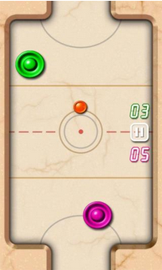

# DLLTWZ_GUI
This is a team project for the real time class.

##一、项目名称
###**桌面冰球游戏GUI子系统**

##二、设计目标

 - 输入：击球器、冰球的当前位置和速度。

 - 输出：每个控制周期两个驱动轴的实时位置和速度指令。

 - 主要参数：与物理引擎子系统的参数相一致。

 - 功能：能实时显示击球器和冰球在游戏桌上的运动，并提供适当的人机操作接口。

##三、项目成员
|班级  |  姓名  |  学号  |  Github账号名  |  博客园账号名|
|-----|-------|--------|--------------|----------|
|机械1303|汤元杰|U201310638| tangyuanjie | 汤元杰 |
|机械1306|李新新|U201311432| New-Lee | New_Lee |
|机械1308|李含嫣|U201310795|  lihanyan|  lihanyan|
|机械1308|邓少丰|U201310815| fengshaofeng | 风少丶 |
|机械1308|王成蹊 |U201310810| lxgszc | lxgszc |
|机械1308|汪凯|U201310816| hacktw | hacktw |

##四、需求分析

+ 根据冰球和击球器的当前位置和速度，在前端做实时更新
+ 分数显示，并根据比赛进程按照一定的计分规则刷新比分
+ 人机交互，比如游戏模式的选择，游戏的开始与暂停，保存游戏数据，得分排名等

##五、功能分解

+ 学习QT，绘制基本界面
+ 对接策略组和物理引擎组的接口 获取冰球和击球器的当前位置
+ 做人机交互的逻辑处理
+ 完善界面，可加上适量动画提高游戏感官质量....
+ 测试

##六、概要设计

+ 参考此界面绘制前端
+ 在网上参考类似游戏参考人机交互的设计和计分方法
+ 参考google c++规范编写逻辑代码和测试代码
+ 参考github合作规范进行项目合作，进度控制和讨论

##七、团队分工

|成员 |任务 |
|-----|----------|
| tangyuanjie  lihanyan         | 使用QT编写界面   |
| lxgszc  New_Lee               | 获取数据        |
| hacktw 风少丶                  | 人机交互逻辑    |
